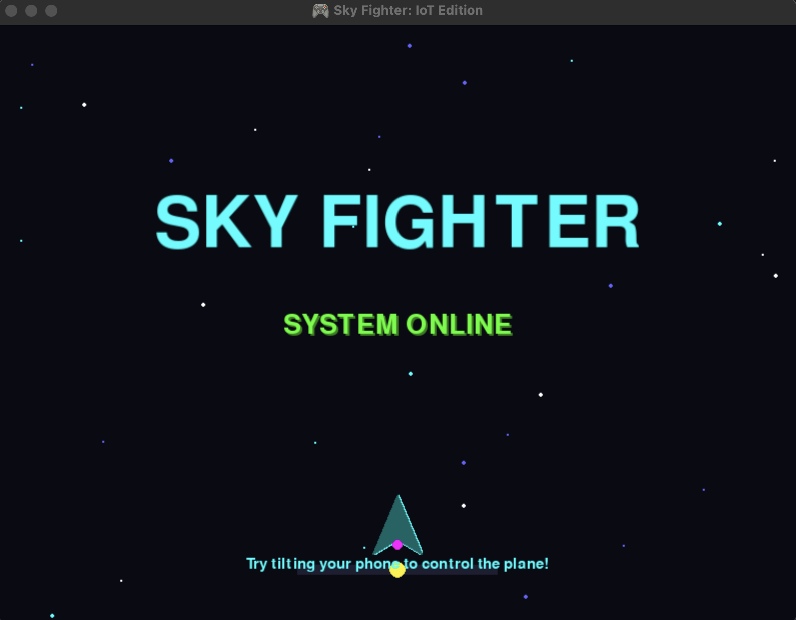
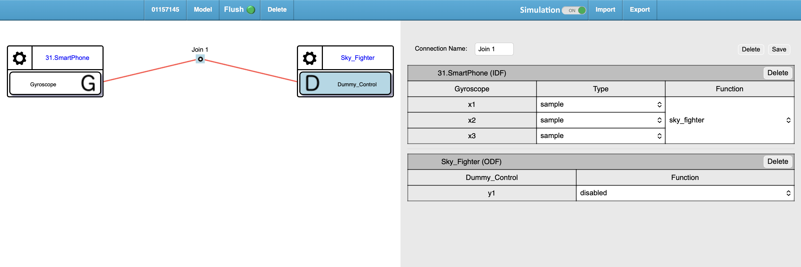
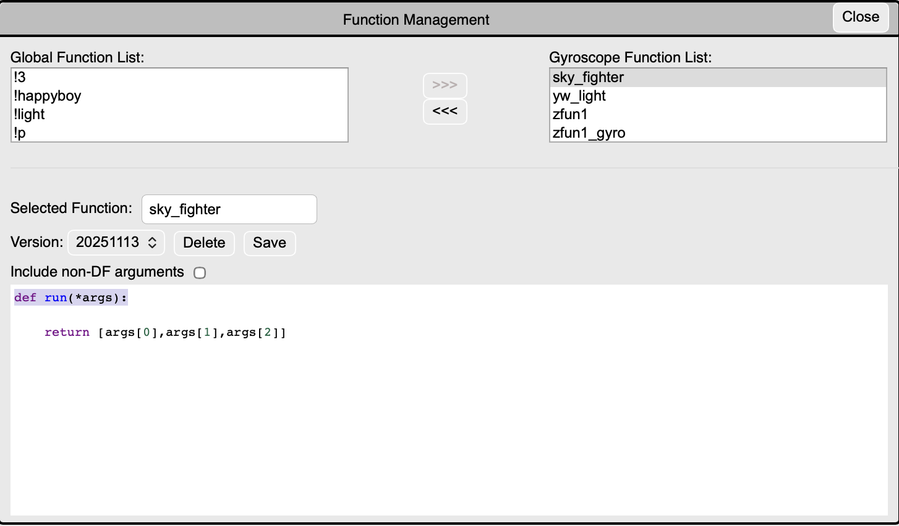

# 🎮 IoTtalk 體感飛機大戰遊戲 (Sky Fighter)

[](https://github.com/itsYoga/sky_fighter)

這是一個使用 **IoTtalk** 平台和手機體感控制器（類似 Joy-Con）來控制 Python Pygame 遊戲的創意專案！

## 📋 專案簡介

- **輸入端**: 使用 IoTtalk 的 **Smartphone** 功能（手機掃 QR Code），利用手機的 **Gyroscope (陀螺儀)** 發送數據
- **伺服器**: IoTtalk 平台負責轉發數據
- **輸出端**: Python 程式 (`Game.py`) 接收數據並控制 Pygame 遊戲中的飛機
- **測試工具**: `test_tilt_data.py` 用於校準和測試感測器數據

## ✨ 專案亮點

1. **整合度高**: 將 Web IoT 技術 (IoTtalk) 與本機應用程式 (Python/Pygame) 完美結合
2. **即時性**: 使用多執行緒 (Multi-threading) 技術，將網路通訊與遊戲渲染分開，確保遊戲畫面流暢不卡頓
3. **沉浸式體驗**: 利用手機陀螺儀模擬飛機操縱桿，提供鍵盤無法比擬的操作體驗

## 📸 專案展示

### 遊戲主畫面


### 遊戲遊玩演示視頻
<video src="screenshot/gameplay.mov" controls width="800">
  您的瀏覽器不支援視頻播放。請下載視頻文件查看：<a href="screenshot/gameplay.mov">gameplay.mov</a>
</video>

### IoTtalk 設置截圖
- **Device Model 設置**: 
- **Global Function 設置**: 

## 🛠️ 環境準備

### 1. 安裝 Python 套件

```bash
cd "/Users/jesse/Documents/School Work/AIoT/Sky_Fighter_IoTtalk"
pip install -r requirements.txt
```

或手動安裝：

```bash
pip install pygame requests paho-mqtt
```

### 2. 確認檔案結構

專案資料夾應包含以下檔案：

```
Sky_Fighter_IoTtalk/
├── Game.py              # 遊戲主程式（結合 Pygame 和 IoTtalk）
├── SA.py                # IoTtalk 裝置端設定檔
├── test_tilt_data.py    # 感測器數據測試和校準工具
├── DAI.py               # IoTtalk SDK（自動處理裝置註冊和通訊）
├── DAN.py               # IoTtalk SDK（資料存取層）
├── csmapi.py            # IoTtalk SDK（通訊 API）
├── Agent.py             # IoTtalk SDK（代理程式）
├── requirements.txt     # Python 套件清單
└── README.md            # 本說明文件
```

## 📱 IoTtalk 網頁設置步驟

### 步驟 1: 登入 IoTtalk

1. 開啟瀏覽器，前往 `https://class.iottalk.tw`
2. 登入你的帳號

### 步驟 2: 建立 Device Model（如果還沒有 Dummy_Device）

1. 進入 **Device Model** 頁面
2. 檢查是否有 `Dummy_Device` 這個 Device Model
3. 如果沒有，請建立一個：
   - **DM Name**: `Dummy_Device`
   - **ODF**: `Dummy_Control` (Data Type: Number)

參考截圖：


### 步驟 3: 在畫布上佈署裝置

1. 進入 **Canvas**（畫布）頁面
2. **添加 Smartphone 裝置**:
   - 從左側裝置列表選擇 **Smartphone**
   - 拖放到畫布上
   - 點擊裝置，選擇功能 **Gyroscope** (陀螺儀)
   - 點擊裝置上的 **播放按鈕** 啟動裝置
   - 會出現 **QR Code**，用手機掃描即可連接

3. **添加 Dummy_Device 裝置**:
   - 從左側裝置列表選擇 **Dummy_Device**
   - 拖放到畫布上
   - 選擇 ODF: **Dummy_Control**
   - 點擊裝置上的 **播放按鈕** 啟動裝置（等待 Python 程式連線）

### 步驟 4: 連接裝置

1. 從 **Smartphone** 的 **Gyroscope** 拉一條線到 **Dummy_Device** 的 **Dummy_Control**
2. **重要**: 確保連接的是 Gyroscope 的**數值輸出（x1, x2, x3）**，而不是方向描述輸出
3. 確認連線成功（線條變成實線）

**提示**: 如果需要使用 Global Function（如 `sky_fighter`），可以在 Canvas 上添加 Function 節點，參考以下設置：


## 🎮 執行遊戲

### 方法 1: 使用 DAI.py（推薦）

這是最標準的方式，會自動處理 IoTtalk 連線：

```bash
cd "/Users/jesse/Documents/School Work/AIoT/Sky_Fighter_IoTtalk"
python3 DAI.py SA
```

然後在**另一個終端機**執行遊戲：

```bash
cd "/Users/jesse/Documents/School Work/AIoT/Sky_Fighter_IoTtalk"
python3 Game.py
```

### 方法 2: 直接執行 Game.py（簡化版）

`Game.py` 已經內建 IoTtalk 連線功能，可以直接執行：

```bash
cd "/Users/jesse/Documents/School Work/AIoT/Sky_Fighter_IoTtalk"
python3 Game.py
```

## 🎯 遊戲操作

1. **移動飛機**: 傾斜手機左右移動（手機向左傾 = 飛機向左，手機向右傾 = 飛機向右）
2. **發射子彈**: **自動發射**（無需按鍵，遊戲開始後自動持續發射）
3. **擊敗敵人**: 用子彈擊中敵人，每擊中一個得分
4. **避免碰撞**: 不要讓敵人撞到你的飛機，否則遊戲結束

## 🧪 感測器校準和測試

在開始遊戲前，建議先運行測試工具來校準感測器：

```bash
cd "/Users/jesse/Documents/School Work/AIoT/Sky_Fighter_IoTtalk"
python3 test_tilt_data.py
```

### 測試步驟：

1. **保持手機水平 5 秒**（基準值 - 用於計算中間點）
2. **向右傾斜到極限 8 秒**（盡可能向右傾斜）
3. **回到水平 3 秒**
4. **向左傾斜到極限 8 秒**（盡可能向左傾斜）
5. **回到水平 3 秒**

測試完成後，程式會自動顯示：
- 🎯 中間點（基準值）
- ➡️ 極右值（最大值）
- ⬅️ 極左值（最小值）
- 💡 Game.py 建議設定（可直接使用）

這些數值會自動更新到 `Game.py` 中，確保控制準確。

## 🔧 疑難排解

### 問題 1: 遊戲無法連線到 IoTtalk

**解決方法**:
- 確認 `SA.py` 中的 `ServerURL` 正確（`https://class.iottalk.tw`）
- 確認 IoTtalk 網頁上的裝置已啟動（播放按鈕是綠色）
- 檢查防火牆設定

### 問題 2: 飛機不動或移動方向相反

**解決方法**:
1. **先運行測試工具** `test_tilt_data.py` 來校準感測器
2. 根據測試結果，`Game.py` 會自動更新參數
3. 如果方向仍然相反，打開 `Game.py`，找到 `iottalk_listener()` 函數
4. 將 `current_tilt = offset * scale_factor` 改成 `current_tilt = -offset * scale_factor`（反轉方向）
5. 調整 `dead_zone` 和 `scale_factor` 來改變靈敏度：
   - `dead_zone` 增大：需要更大傾斜才會移動
   - `scale_factor` 增大：更靈敏

### 問題 3: 手機數據沒有傳送

**解決方法**:
- 確認手機已掃描 QR Code 並連線
- 確認 IoTtalk 網頁上 Smartphone 裝置顯示「已連線」
- 確認連線正確：Smartphone (Gyroscope) -> Dummy_Device (Dummy_Control)
- **重要**: 確保連接的是 Gyroscope 的**數值輸出（x1, x2, x3）**，而不是方向描述輸出
- 如果收到方向字符串（如 '平躺'、'橫擺'），請檢查 Canvas 連接並切換到數值輸出
- 嘗試傾斜手機，觀察 IoTtalk 網頁上的數據是否有變化

### 問題 4: 遊戲畫面卡頓

**解決方法**:
- 降低 `Game.py` 中的 `FPS` 值（例如從 60 改成 30）
- 增加 `iottalk_listener()` 中的 `time.sleep(0.05)` 值（例如改成 0.1）

## 📸 展示建議

在報告或展示時，建議包含以下內容：

1. **遊戲主畫面截圖** (`screenshot/game_homescreen.png`) - 展示遊戲界面和 UI 設計
2. **遊戲遊玩視頻** (`screenshot/gameplay.mov`) - 展示實際操作效果和體感控制
3. **IoTtalk Device Model** (`screenshot/iottalk_model.png`) - 展示 IoTtalk 設置和配置
4. **Global Function 設置** (`screenshot/sky_fighter_function.png`) - 展示數據處理函數配置
5. **終端機輸出**: 顯示「Register successfully」和數據接收訊息，證明連線成功

## 🚀 進階擴展

如果你想讓這個專案更進階，可以嘗試：

1. **手動發射**: 把手機的「搖晃」或「點擊」動作設為發射子彈（需要從 IoTtalk 傳另一個訊號）
2. **多軸控制**: 使用 Beta 值控制飛機上下移動
3. **音效**: 添加射擊和爆炸音效
4. **圖片素材**: 替換成真實的飛機和敵人圖片
5. **分數排行榜**: 記錄最高分數
6. **難度調整**: 根據分數動態調整敵人生成速度和數量

## ⚙️ 技術細節

### 控制參數說明

`Game.py` 中的控制參數會根據 `test_tilt_data.py` 的測試結果自動調整：

- **baseline**: 基準值（水平時的平均 Gamma 值）
- **dead_zone**: 死區（過濾小幅震動，偏移小於此值時視為水平）
- **scale_factor**: 縮放因子（將 Gamma 偏移映射到 -10 到 10 的範圍）

### 數據格式

Gyroscope 數據格式：`[[alpha, beta, gamma]]`
- **Alpha (α)**: 繞 Z 軸旋轉（yaw）
- **Beta (β)**: 繞 X 軸旋轉（pitch）
- **Gamma (γ)**: 繞 Y 軸旋轉（roll）- 用於左右傾斜控制

## 📝 程式碼說明

### Game.py
- 遊戲主程式，結合 Pygame 和 IoTtalk
- 使用多執行緒處理 IoTtalk 連線，避免阻塞遊戲迴圈
- `iottalk_listener()`: 在背景執行緒中持續從 IoTtalk 拉取 Gyroscope 數據（Gamma 值）
- `Player.update()`: 根據 `current_tilt` 變數移動飛機
- 自動射擊系統：子彈每 0.25 秒自動發射
- 使用基準值偏移和縮放因子來精確控制飛機移動

### SA.py
- IoTtalk 裝置端設定檔
- 定義裝置模型、ODF 列表等
- `Dummy_Control()`: 接收手機數據的函數（可選，主要處理在 Game.py）

### test_tilt_data.py
- 感測器數據測試和校準工具
- 自動檢測中間點、極右值、極左值
- 提供 Game.py 的建議設定參數
- 支援 Gyroscope 數據格式：`[[alpha, beta, gamma]]`

## 📄 授權

本專案僅供學習使用。

## 👨‍💻 作者

Jesse - AIoT Lab 5 專案

## 🔗 相關連結

- **GitHub 倉庫**: [https://github.com/itsYoga/sky_fighter](https://github.com/itsYoga/sky_fighter)
- **IoTtalk 平台**: [https://class.iottalk.tw](https://class.iottalk.tw)

---

**祝遊戲愉快！🎮✨**

